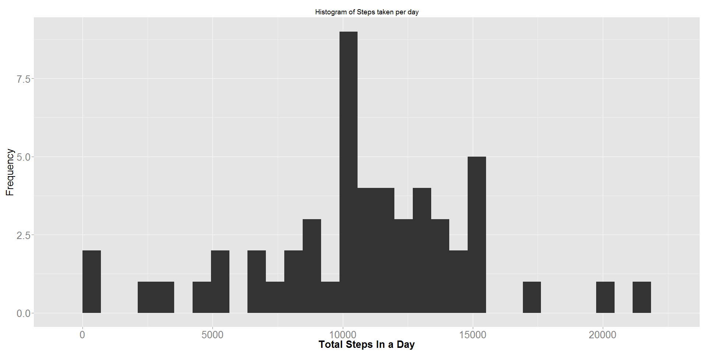
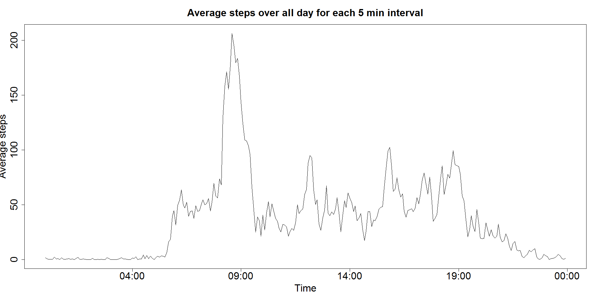
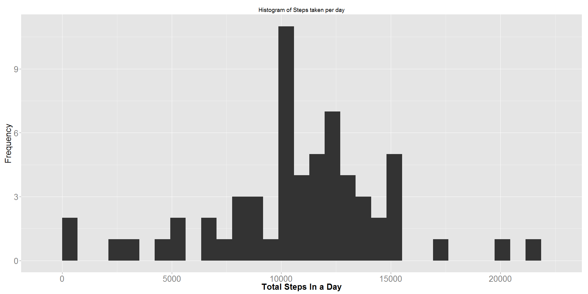
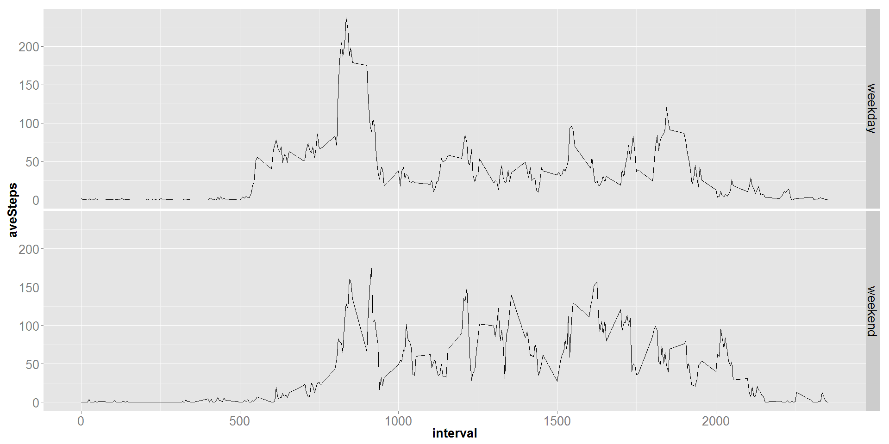

# Reproducible Research: Peer Assessment 1

### Load libraries


```r
library(dplyr)
library(ggplot2)
library(stringr)
library(scales)
```


## 1 Loading and preprocessing the data  
  
### 1.1 Unzip existing ZIP file if required and create dataset from the CSV file.

Unzip the file if it has not been unzip and load it as a dataset.


```r
if(!file.exists("activity.csv")){
  unzip("activity.zip")
}
dataset <- read.csv("activity.csv")
```
  
  
### 1.2 The format data into usable format

Combine date and time component to a datetime POSTIXct field.


```r
dataset$intervalPadded <- str_pad(dataset$interval, 4, pad = "0")
dataset$datetime <- as.POSIXct(strptime(paste(dataset$date, dataset$intervalPadded), "%Y-%m-%d %H%M"))
dataset$intervalPadded <- NULL
dataset$date <- NULL
head(dataset)
```

```
##   steps interval            datetime
## 1    NA        0 2012-10-01 00:00:00
## 2    NA        5 2012-10-01 00:05:00
## 3    NA       10 2012-10-01 00:10:00
## 4    NA       15 2012-10-01 00:15:00
## 5    NA       20 2012-10-01 00:20:00
## 6    NA       25 2012-10-01 00:25:00
```

## 2 What is mean total number of steps taken per day?

### 2.1 Aggregate data by day

Assigment states to ignore missing values from dataset for this part of the assignment. Therefore "NA" data will be filtered out.


```r
naFilteredData <- dataset[!is.na(dataset$steps),]
naFilteredData$date <- as.Date(naFilteredData$datetime, tz = Sys.timezone(location = TRUE))
sumByDay <- naFilteredData %>%
    group_by(date) %>%
    summarise(totalSteps=sum(steps)) %>%
    arrange(date)
rm(naFilteredData)

head(sumByDay)
```

```
## Source: local data frame [6 x 2]
## 
##         date totalSteps
##       (date)      (int)
## 1 2012-10-02        126
## 2 2012-10-03      11352
## 3 2012-10-04      12116
## 4 2012-10-05      13294
## 5 2012-10-06      15420
## 6 2012-10-07      11015
```

### 2.2 Generate histogram of steps per day


```r
qplot(totalSteps, data=sumByDay, geom="histogram") + 
  theme(axis.text=element_text(size=20), 
        axis.title=element_text(size=20,face="bold")) +
  labs(x="Total Steps In a Day",
         y=expression('Frequency'), 
         title=expression('Histogram of Steps taken per day'))
```

 

### 2.3 Calculate mean and median


```r
summaryStepsPerDayWithNA <- summary(sumByDay$totalSteps)
summaryStepsPerDayWithNA[c("Mean", "Median")]
```

```
##   Mean Median 
##  10770  10760
```


## 3 What is the average daily activity pattern?

### 3.1 Aggregate data by time

Set all date component to be on the same day and take average over each 5 min interval


```r
naFilteredData <- dataset[!is.na(dataset$steps),]
naFilteredData$timeString <- strftime(naFilteredData$datetime, format="%H:%M")
naFilteredData$time <- as.POSIXct(strptime(paste('2015-01-01', naFilteredData$timeString), "%Y-%m-%d %H:%M"))
aveByTime <- naFilteredData %>%
    group_by(time) %>%
    summarise(aveSteps=mean(steps)) %>%
    arrange(time)
rm(naFilteredData)

head(aveByTime)
```

```
## Source: local data frame [6 x 2]
## 
##                  time  aveSteps
##                (time)     (dbl)
## 1 2015-01-01 00:00:00 1.7169811
## 2 2015-01-01 00:05:00 0.3396226
## 3 2015-01-01 00:10:00 0.1320755
## 4 2015-01-01 00:15:00 0.1509434
## 5 2015-01-01 00:20:00 0.0754717
## 6 2015-01-01 00:25:00 2.0943396
```

### 3.2 Generate line graph for average steps taken across all days


```r
with(aveByTime, plot(time, 
                     aveSteps, 
                     type = "l", 
                     main="Average steps over all day for each 5 min interval",
                     xlab="Time",
                     ylab="Average steps",
                     cex.main=2, 
                     cex.lab=2,
                     cex.axis=2))
```

 

### 3.3 Find time interval with maximum average steps over all days


```r
maxInterval <- aveByTime[aveByTime$aveSteps==max(aveByTime$aveSteps), ]
strftime(maxInterval$time, format="%H:%M")
```

```
## [1] "08:35"
```


## 4 Imputing missing values

### 4.1 Report total number of missing values


```r
naSteps <- summary(dataset$steps)
naSteps["NA's"]
```

```
## NA's 
## 2304
```


### 4.2 Replace NAs 

Replace NA with average for that 5 min over that same day of the week.

#### 4.2.1 Generate average for each interval and day of the week


```r
naFilteredData <- dataset[!is.na(dataset$steps),]
naFilteredData$timeDayOfWeek <- strftime(naFilteredData$datetime, format="%H:%M %a")
aveByTimeDayOFWeek <- naFilteredData %>%
    group_by(timeDayOfWeek) %>%
    summarise(aveSteps=mean(steps)) %>%
    arrange(timeDayOfWeek)
rm(naFilteredData)

head(aveByTimeDayOFWeek)
```

```
## Source: local data frame [6 x 2]
## 
##   timeDayOfWeek aveSteps
##           (chr)    (dbl)
## 1     00:00 Fri 0.000000
## 2     00:00 Mon 1.428571
## 3     00:00 Sat 0.000000
## 4     00:00 Sun 0.000000
## 5     00:00 Thu 5.875000
## 6     00:00 Tue 0.000000
```

#### 4.2.1 Generate new dataset with no NAs


```r
noNadataset <- dataset[!is.na(dataset$steps),]
withNA <- dataset[is.na(dataset$steps),]
withNA$timeDayOfWeek <- strftime(withNA$datetime, format="%H:%M %a")
withNA <- merge(x=withNA, y=aveByTimeDayOFWeek, by = "timeDayOfWeek")
withNA$steps <- withNA$aveSteps
withNA$aveSteps <- NULL
withNA$timeDayOfWeek <- NULL
noNadataset <- rbind(noNadataset, withNA)
rm(withNA)

naSteps <- summary(noNadataset$steps)
naSteps["NA's"]
```

```
## <NA> 
##   NA
```


#### 4.3 Generate histogram for new dataset with no NAs


```r
tempdataSet <- noNadataset
tempdataSet$date <- as.Date(tempdataSet$datetime, tz = Sys.timezone(location = TRUE))
sumByDay <- tempdataSet %>%
    group_by(date) %>%
    summarise(totalSteps=sum(steps)) %>%
    arrange(date)

qplot(totalSteps, data=sumByDay, geom="histogram") + 
  theme(axis.text=element_text(size=20), 
        axis.title=element_text(size=20,face="bold")) +
  labs(x="Total Steps In a Day",
         y=expression('Frequency'), 
         title=expression('Histogram of Steps taken per day'))
```

 

### 4.4 Calculate mean and median


```r
summaryStepsPerDayNoNA <- summary(sumByDay$totalSteps)
summaryStepsPerDayNoNA[c("Mean", "Median")]
```

```
##   Mean Median 
##  10820  11020
```

### 4.5 Difference between mean and median before and after inputting missing values

The % diffence between the two are negligible.


```r
percentageDifference <- (summaryStepsPerDayNoNA - summaryStepsPerDayWithNA) * 100 /summaryStepsPerDayWithNA
percentageDifference[c("Mean", "Median")]
```

```
##      Mean    Median 
## 0.4642526 2.4163569
```


## 5 Are there differences in activity patterns between weekdays and weekends?

### 5.1 Create new factor variable in dataset with two levels


```r
noNadataset$dayOfWeek <- strftime(noNadataset$datetime, format="%u")
noNadataset$typeOfDay <- ifelse(noNadataset$dayOfWeek %in% c('6','7'), "weekend", "weekday")
noNadataset$dayOfWeek <- NULL
head(noNadataset)
```

```
##     steps interval            datetime typeOfDay
## 289     0        0 2012-10-02 00:00:00   weekday
## 290     0        5 2012-10-02 00:05:00   weekday
## 291     0       10 2012-10-02 00:10:00   weekday
## 292     0       15 2012-10-02 00:15:00   weekday
## 293     0       20 2012-10-02 00:20:00   weekday
## 294     0       25 2012-10-02 00:25:00   weekday
```

### 5.2 Generate Plot to compare weekend and weekday activity

#### 5.2.1 Aggregate dataset

```r
noNadataset$timeString <- strftime(noNadataset$datetime, format="%H:%M")
noNadataset$time <- as.POSIXct(strptime(paste('2015-01-01', noNadataset$timeString), "%Y-%m-%d %H:%M"))
noNadataset$datetime <- NULL
noNadataset$timeString <- NULL

aveByTimeTypeOfDay <- noNadataset %>%
    group_by(typeOfDay, interval) %>%
    summarise(aveSteps=mean(steps)) %>%
    arrange(typeOfDay, interval)
head(aveByTimeTypeOfDay)
```

```
## Source: local data frame [6 x 3]
## Groups: typeOfDay [1]
## 
##   typeOfDay interval   aveSteps
##       (chr)    (int)      (dbl)
## 1   weekday        0 2.31071429
## 2   weekday        5 0.45000000
## 3   weekday       10 0.17500000
## 4   weekday       15 0.20000000
## 5   weekday       20 0.08888889
## 6   weekday       25 1.56388889
```

#### 5.2.2 Generate Graph


```r
qplot(interval,aveSteps,data=aveByTimeTypeOfDay,facets = typeOfDay~.,geom=c("line")) + 
  theme(axis.text=element_text(size=20),  
        strip.text=element_text(size=20),
        axis.title=element_text(size=20,face="bold"))
```

 
